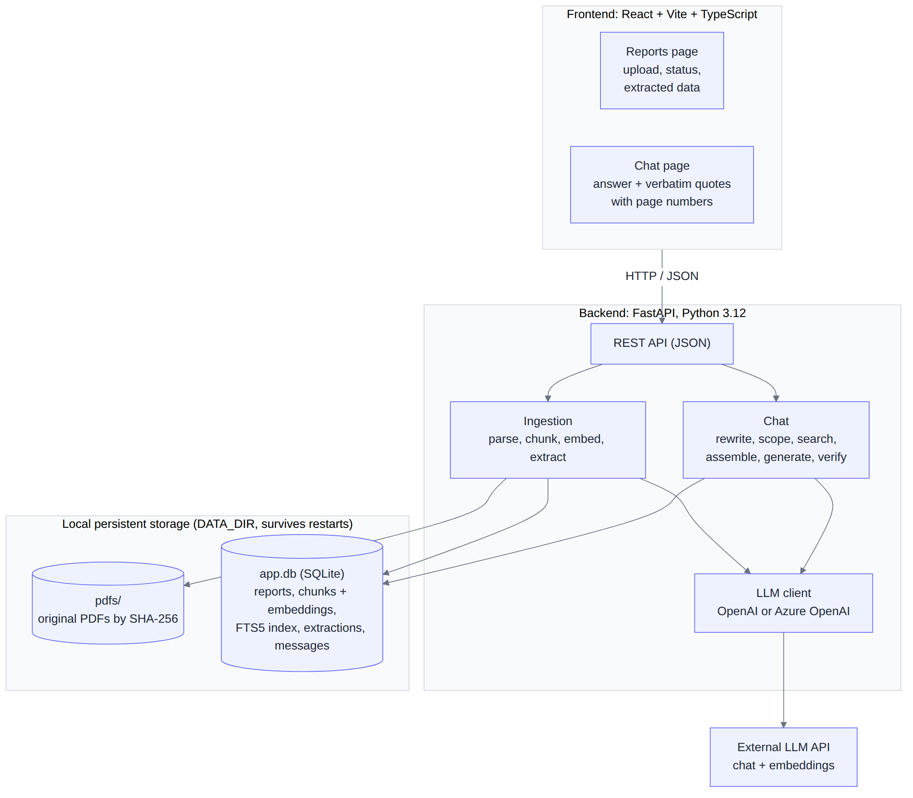
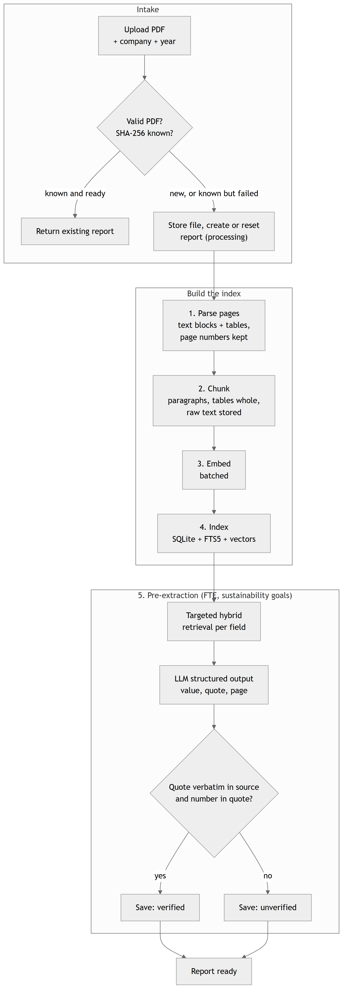
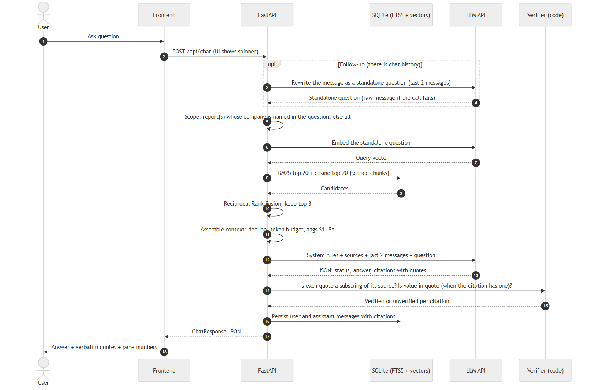

# Annual Report RAG Assistant

A locally runnable assistant for reviewing annual reports: upload PDFs, inspect extracted workforce and sustainability-goal data, and ask questions about the report content with verbatim quotes and page references. Every factual claim shown to you is backed by an exact quote from the source PDF, checked in code, not just asserted by the model — if a report doesn't contain the answer, the app says so instead of guessing.

## Setup and running it

### Option A: Docker (recommended)

```bash
cp .env.example .env   # then add your OPENAI_API_KEY
docker compose up --build
```

Open **http://localhost:8000**. The `data-app/` folder (created next to this file) is a mounted volume, so reports and extractions survive `docker compose down` and back up. Chat history does not — it's cleared on every startup, by design, so a restart always begins a fresh conversation.

### Option B: Local (no Docker)

Needs Python 3.12 and Node 20+.

```bash
# 1. Add your key
cp .env.example .env   # then add your OPENAI_API_KEY

# 2. Backend
cd backend
pip install uv          # if you don't already have uv
uv sync
uv run uvicorn app.main:app --port 8000

# 3. Frontend (separate terminal)
cd frontend
npm install
npm run dev             # opens on http://localhost:5173, proxies /api to :8000
```

In this mode, use the frontend's own URL (**http://localhost:5173**), not :8000 — the backend alone doesn't serve the UI unless it's the Docker build (which bundles the built frontend into the backend image).

## Input data

Two things feed this app:

**1. PDF reports.** Uploaded through the **Reports** page. Company name and fiscal year are typed at upload (pre-filled by guessing from the filename when it can). Any real annual report PDF works.

**2. An LLM provider — OpenAI or Azure OpenAI.** Configured through `.env` (see `.env.example` for the full list):

```
LLM_PROVIDER=openai            # or "azure"
OPENAI_API_KEY=sk-...          # if using openai
```

For Azure OpenAI instead, set `LLM_PROVIDER=azure` and fill in `AZURE_OPENAI_API_KEY`, `AZURE_OPENAI_ENDPOINT`, and set `CHAT_MODEL`/`EMBEDDING_MODEL` to your deployment names. Both providers work identically everywhere in the app. Two kinds of calls are made throughout: a **chat model** (extraction, follow-up rewriting, answering) and an **embedding model** (semantic search).

## Running the application

- Go to **Reports**, upload a PDF, type the company and fiscal year, and wait for it to reach `Ready`. Ingestion (parsing, chunking, embedding, extracting FTE/goals) takes roughly 1–3 minutes depending on report length.
- Go to **Chat** and ask a question, e.g. *"How much did Shell spend on climate change adaptation in 2025?"* or *"How many FTE does the company have?"*.
- Restart the app (`docker compose restart`, or stop and re-run the local commands) — reports and extractions are all still there; chat starts fresh, on purpose.

## Architecture



A FastAPI backend, a React/Vite frontend, and SQLite with FTS5 for the keyword index and local persistence. The frontend talks to the backend over plain JSON REST. The backend has two jobs — ingestion (parse, chunk, embed, extract) and chat (rewrite, scope, search, assemble, generate, verify) — both going through one thin LLM client that supports OpenAI or Azure OpenAI. Everything durable (original PDFs, chunks and embeddings, the search index, extracted facts, chat messages) lives under one local data directory that survives restarts.

## Pipeline

### Ingestion



- **Parsing** — PyMuPDF extracts each page's text and tables, ordering multi-column layouts correctly (grouped by column, then top-to-bottom) rather than reading raw stream order, and dropping running headers, footers and side-navigation chrome that would otherwise interleave with real content.
- **Chunking** — paragraphs are packed together up to a target size; tables are always kept whole, with the header row repeated on every part if a table has to be split, so a figure is never separated from the label that explains it.
- **Embedding** — chunks are embedded in batches, then indexed two ways at once: a keyword index (SQLite FTS5) and an in-memory vector index for semantic search.
- **Extraction** — two specific facts, workforce FTE and sustainability goals, are pulled out immediately via targeted retrieval and a model call, each one checked against its source and stored as verified or unverified before ingestion is considered done.

### Chat: retrieval through verification



- **Retrieval** — a follow-up gets rewritten into a standalone question using recent chat history, scoped to the report(s) named in it, then searched two ways at once — exact keyword matching and semantic similarity — and combined by reciprocal rank fusion so neither method alone decides what's relevant.
- **Context assembly** — the fused results are deduplicated, capped to a token budget, and tagged with a stable source id so the model has something concrete to cite.
- **Generation** — one structured model call produces the answer text and its citations together, required to copy each citation's quote character-for-character before writing any surrounding prose.
- **Verification** — every quote is checked in code as a literal substring of its real source chunk, and every claimed number is checked as a literal substring of its own quote — never trusted from the model alone.

### Evaluation

A set of test questions, generated from the reports' own content, is run through the real pipeline end-to-end to measure whether retrieval finds the right evidence and whether answers stay grounded in it — alongside the unit and integration test suite (see Testing below), which exercises the pipeline's individual pieces offline.

## Guardrails

- **Upload validation** — a PDF is checked for its real file signature and a size limit while streaming to disk (never loaded into memory whole), then stored under a content hash rather than a user-supplied filename.
- **Groundedness** — the core guarantee of this app: every quote and every numeric claim is checked in code against the real source text, an inline citation marker with no evidence behind it is flagged, and a number typed into an answer's prose without a citation backing it is flagged too.
- **Abstention** — the model must say it doesn't know (or only partly knows) rather than guess when the sources don't contain an answer; citations are cleared in code whenever that happens, regardless of what the model itself returned.
- **Prompt injection** — report text is untrusted input: it's wrapped in explicit delimiters, and the system prompt states that any instructions found inside it must be ignored.
- **SQL injection** — every database query, including full-text search, uses parameterised placeholders; no query is ever built by concatenating user input into SQL.
- **Secrets and data** — API keys live only in environment variables, never sent to the browser or logged.

## Testing

```bash
cd backend
uv run ruff check .
uv run ruff format --check .
uv run pytest
cd ../frontend
npm run typecheck
```

77 backend tests (unit + integration, all offline via a fake LLM/embedder) plus a generated fixture PDF exercising the real parsing/chunking/table-detection code.

## Known limitations

- Single-user, no authentication — this is a local tool, not a shared deployment.
- Company/report scoping is a case-insensitive substring match on company name; it won't catch aliases ("Royal Dutch Shell" vs "Shell").
- A question naming two companies in one follow-up (e.g. "what about cm.com and heineken") only carries one of them through — asking about each company separately works.
- No OCR — a fully scanned (image-only) report will have those pages skipped.
- Only the last 2 chat messages are used for follow-up context; long multi-topic conversations will lose earlier context.
- No PDF viewer — citations give a page number, not a clickable link into the source PDF.
